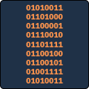

<!-- PROJECT LOGO -->
 

  

  <h3 align="center">SharodeOS</h3>

  

    Welcome to SharodeOS!
  

<!-- TABLE OF CONTENTS -->

  
<h2 style="display: inline-block">Table of Contents</h2>

  <ol>
    <li>
      <a href="#about-the-project">About The Project</a>
      <ul>
        <li><a href="#built-with">Built With</a></li>
      </ul>
    </li>
    <li><a href="#roadmap">Roadmap</a></li>
    <li><a href="#license">License</a></li>
    <li><a href="#contact">Contact</a></li>
    <li><a href="#acknowledgements">Acknowledgements</a></li>
  </ol>

<!-- ABOUT THE PROJECT -->
## About The Project
This is a personal project to explore OS development.

### Built With

* [Qemu](https://www.qemu.org/)
* 

<!-- ROADMAP -->
## Roadmap

See the [open issues](https://github.com/github_username/repo_name/issues) for a list of proposed features (and known issues).

<!-- LICENSE -->
## License

Distributed under the GNU License. See `LICENSE` for more information.

<!-- CONTACT -->
## Contact

Jacob McIntyre - [@twitter_handle](https://twitter.com/twitter_handle) - email

<!-- ACKNOWLEDGEMENTS -->
## Acknowledgements

* [OS Dev](https://wiki.osdev.org)
* [Best-README-Template](https://github.com/othneildrew/Best-README-Template)